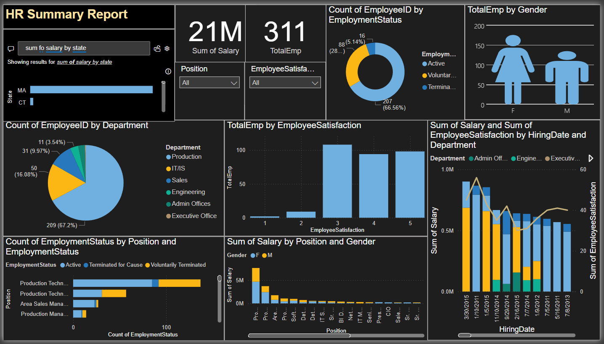

# 👥 HR Summary Dashboard - Power BI

An interactive HR Analytics dashboard built in Power BI to visualize and analyze key employee metrics such as salary distribution, employee satisfaction, department-wise headcount, and hiring trends.

---

## 📌 Purpose

This dashboard helps HR managers and decision-makers to:
- Identify patterns in employee satisfaction
- Track salary distribution by state, position, and gender
- Analyze department-wise and employment status metrics
- Monitor hiring trends and organizational performance over time

---

## 🧰 Tech Stack

- 📊 **Power BI Desktop** – For designing interactive dashboards
- 📂 **Power Query** – Used for importing, shaping, and transforming data
- 🧠 **DAX** – Used for custom measures and calculated columns
- 🏗️ **Data Modeling** – Relationships between employee data fields
- 📁 **File Format** – `.pbix` for the report and `.png` for dashboard preview

---

## 📂 Data Source

The dataset used in this dashboard includes fictional employee records, including:
- Personal details (Gender, Date of Birth, Marital Status)
- Job-related information (Position, Department, Salary, Performance Score)
- Employment data (Hiring Date, Termination Date, Employment Status, Satisfaction Score)

> 📌 **Note**: This data is dummy HR data for demonstration purposes.

---

## 🌟 Features & Highlights

### • Business Problem
HR teams often struggle to derive insights from flat employee data. There's a need for a unified view to make data-driven decisions regarding retention, hiring, and performance.

### • Dashboard Goal
To provide a simple yet powerful tool for HR professionals to:
- Monitor workforce trends
- Analyze satisfaction scores
- Breakdown headcount by role, gender, department

### • Walkthrough of Key Visuals

- **Top Metrics Cards**
  - Total Salary Paid
  - Total Employees
- **Slicers**
  - Position and Satisfaction level (Dropdown filters)
- **Pie Charts**
  - Employee count by Department and Employment Status
- **Bar Charts**
  - Salary by Gender and Position
  - Satisfaction by Hiring Date
- **Custom Icons**
  - Male and Female visual comparison

### • Business Insights
- Discover underperforming departments
- See satisfaction level distribution over time
- Track how salaries are distributed by job position and gender

---

## 📸 Screenshots

---

## 🧑‍💼 Created By

**Deepak Sahoo**  
[🔗 LinkedIn](https://bit.ly/44ylEmk)

---

## 📁 Files

| File Name | Description |
|-----------|-------------|
| `HR_Summary_Report.pbix` | Main Power BI file |
| `hr-summary-dashboard.png` | Dashboard screenshot |
| `README.md` | Project overview |

